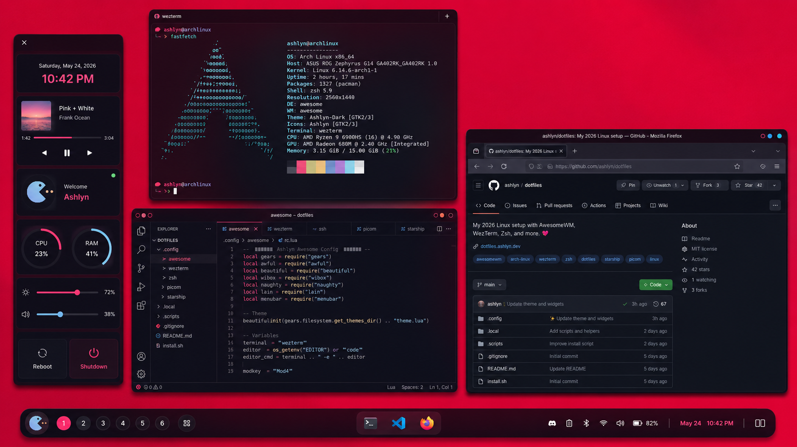

# ✦ Kali Linux Dotfiles

> A modern refresh of my old Linux dotfiles — rebuilt for **Ashlyn**, with AwesomeWM, Zsh, WezTerm, Picom, Starship, Fastfetch, and a cleaner 2026 terminal workflow.

These dotfiles are meant for a fast, neon-dark Linux desktop: keyboard-driven, pretty, minimal, and actually usable for coding/design work.


---

<details open>
<summary><strong>🌌 What changed in this update?</strong></summary>

- Renamed the setup and visible identity to **Ashlyn** everywhere practical.
- Added a real `install.sh` bootstrap script with backups.
- Added a proper Zsh entrypoint: `.config/zsh/.zshrc`.
- Replaced old `exa` aliases with modern `eza` fallbacks.
- Added `fastfetch` config as the modern `neofetch` replacement.
- Added `starship.toml` prompt config.
- Modernized WezTerm with WebGPU, fallback fonts, panes, and reload keybinds.
- Refreshed Picom with safer blur, rounded corners, shadows, and GLX defaults.
- Added package lists for Arch-based and Debian/Kali-based systems.
- Added ripgrep defaults, cleaner aliases, utility functions, and XDG paths.
- Kept the original AwesomeWM structure and assets so the rice still feels like the old one.

</details>

---

<details>
<summary><strong>🧰 Stack</strong></summary>

| Area | Tooling |
|---|---|
| Window manager | AwesomeWM |
| Compositor | Picom |
| Terminal | WezTerm |
| Shell | Zsh |
| Prompt | Starship |
| Fetch | Fastfetch |
| Launcher | Rofi |
| File listing | Eza |
| Search | Ripgrep + fd |
| Smart cd | Zoxide |
| System monitor | Btop |
| File manager | Yazi / Thunar |

</details>

---

<details>
<summary><strong>📦 Install packages</strong></summary>

### Arch / EndeavourOS / Garuda

```bash
sudo pacman -S --needed git base-devel zsh starship zoxide fzf eza bat fd ripgrep fastfetch btop jq unzip rsync curl wget neovim rofi wezterm dunst feh xclip xorg-xrandr network-manager-applet blueman udiskie flameshot playerctl brightnessctl pavucontrol pipewire pipewire-pulse wireplumber thunar tumbler gvfs noto-fonts noto-fonts-emoji
```

For AUR packages like `awesome-git`, `picom-git`, `visual-studio-code-bin`, or Nerd Fonts, use `paru`/`yay`.

### Debian / Kali / Ubuntu based

```bash
sudo apt update
sudo apt install zsh starship zoxide fzf eza bat fd-find ripgrep fastfetch btop jq unzip rsync curl wget git neovim rofi awesome picom wezterm dunst feh xclip network-manager-gnome blueman udiskie flameshot playerctl brightnessctl pavucontrol pipewire pipewire-pulse wireplumber thunar tumbler gvfs fonts-noto-color-emoji fonts-inter
```

Package names can vary by distro version. See `packages/arch.txt` and `packages/debian-kali.txt` for the full checklist.

</details>

---

<details>
<summary><strong>🚀 Install dotfiles</strong></summary>

Clone the repo:

```bash
git clone https://github.com/Ashlyn/ashlyndots ~/.dotfiles
cd ~/.dotfiles
```

Run the installer:

```bash
chmod +x install.sh
./install.sh
```

The installer copies configs and backs up old files to:

```txt
~/.dotfiles-backup-YYYYMMDD-HHMMSS
```

</details>

---

<details>
<summary><strong>⌨️ Main keybinds</strong></summary>

| Key | Action |
|---|---|
| `Mod4 + Enter` | Open terminal |
| `Mod4 + D` | Open app launcher |
| `Mod4 + W` | Close focused window |
| `Mod4 + Ctrl + R` | Restart AwesomeWM |
| `Mod4 + Shift + Q` | Quit AwesomeWM |
| `Mod4 + Tab` | Cycle layouts |
| `Mod4 + 1..9` | Switch tags/workspaces |

Some keybinds depend on the original AwesomeWM config modules.

</details>

---

<details>
<summary><strong>📁 Structure</strong></summary>

```txt
.
├── .config
│   ├── awesome
│   ├── fastfetch
│   ├── picom
│   ├── ripgrep
│   ├── starship
│   ├── wezterm
│   └── zsh
├── .etc
├── .home
├── packages
│   ├── arch.txt
│   └── debian-kali.txt
├── install.sh
└── README.md
```

</details>

---

<details>
<summary><strong>⚠️ Notes</strong></summary>

- This is still an AwesomeWM/X11 rice. It includes Wayland-friendly app environment variables, but AwesomeWM itself is X11.
- The config prefers modern tools but keeps fallbacks so the shell does not break if something is missing.
- Keep private machine-specific changes in `~/.config/zsh/local.zsh`; that file is intentionally not part of the public dotfiles.

</details>

---

## Final vibe

**Ashlyn Dotfiles** is a modernized neon-dark Linux setup for coding, ricing, and daily use — old AwesomeWM soul, cleaner 2026 tooling.
